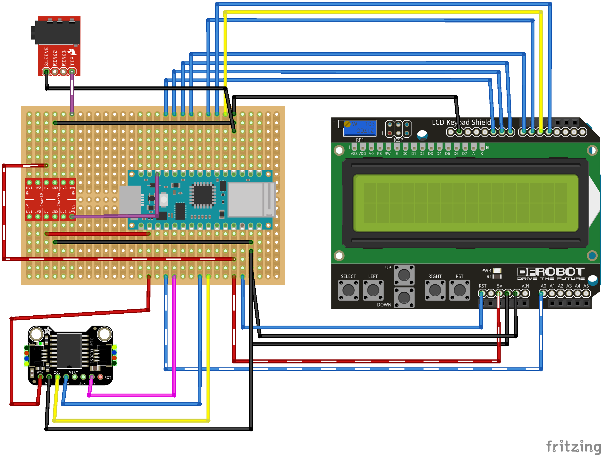

# Signalboy Reference Implementation – Peripheral (Arduino)
## Hardware


Find the full hardware documentation under [Hardware](./Documentation/Hardware/) and its respective [**README (Hardware)**](./Documentation/Hardware/README.md).

## TODO
* [ ] Self-Test: RTC

## Dependencies
* ArduinoBLE (v1.3.1 verified)
* LiquidCrystal

## Prerequisites
### Install _LCDKeypadShieldLib_ library
Install the _LCDKeypadShieldLib_ library by copying the included directory (at [libraries/LCDKeypadShieldLib](./libraries/LCDKeypadShieldLib)) to Arduino IDE's `libraries`-directory (typically at `~/Documents/Arduino/libraries`). Alternatively you could also symlink it to the destination by:
```bash
ln -s "<PATH_TO_YOUR_REPO>/signalboy-arduino/libraries/LCDKeypadShieldLib" "$HOME/Documents/Arduino/libraries/LCDKeypadShieldLib"
```

## Install on Arduino 33 IoT
First make sure to install ArduinoBLE:
> To use this library, open the Library Manager in the Arduino IDE and install it from there.

([ArduinoBLE - Arduino Reference](https://www.arduino.cc/reference/en/libraries/arduinoble/))

<br/>

Then compile & install using `arduino-cli`:
```bash
arduino-cli compile
arduino-cli upload -p <port>  # <port> might look like `/dev/cu.usbmodem1432101`. Find <port> by running `arduino-cli board list`.
```

## Usage
Program starts automatically on Arduino after startup and **waits for Serial Monitor before entering main-loop** (which scans for the [`node`-based Central](../node-peripheral/README.md) to connect to…)  
Thus you'll need to connect any serial-monitor that supports reading:
* E.g. (using `arduino-cli`):
  ```bash
  arduino-cli monitor -p <port>  # <port> might look like `/dev/cu.usbmodem1432101`. Find <port> by running `arduino-cli board list`.
  ```
* or (using `cat`):
  ```bash
  cat <port> # <port> might look like `/dev/cu.usbmodem1432101`. Find <port> by running `arduino-cli board list`.
  ```

### UI
Signalboy comes with a LCD Keypad Shield featuring a lcd-display (16x2) and 6 buttons allowing for a basic interactive UI.

#### General
* When the user pushes any button, the screen's backlight is turned on.
  * The backlight turns off automatically when the user has been inactive for 30 secs.
* If the current state supports user-selectable actions: Pushing ↑(UP) or ↓(DOWN) will open the
  menu and the same buttons allow for browsing the menu. Pushing SELECT on any menu-item will trigger
  the respective action described by its label on the LCD-display. (s. [Actions](#actions) below for an overview of available actions.)
  * The menu closes automatically when the user has been inactive for 15 secs.

#### Actions
Additionally some states might allow the user to browse a menu providing further user-selectable actions (fired by pushing the SELECT-button when the corresponding action is displayed):
|     State     |     Action    |  Description  |
| ------------- | ------------- | ------------- |
|   Connected   | Reject conn.  | Discards the connection with the currently connected Bluetooth client (or _Central_ in BLE-terms), i.e. the Meta Quest headset. Note: Further connection attempts of that client are subsequently dropped for the next 30 secs. |

## Known limitations
* User interaction is not possible during Training (Time-Sync) or shortly
after the Signalboy has received a Target-Timestamp.

## License
The software in this project is licensed under the [MIT License](./LICENSE).

The documentation (i.e. diagrams or schematics) of the hardware in this project is licensed under the [GNU General Public License v2.0](./Documentation/Hardware/COPYING).
